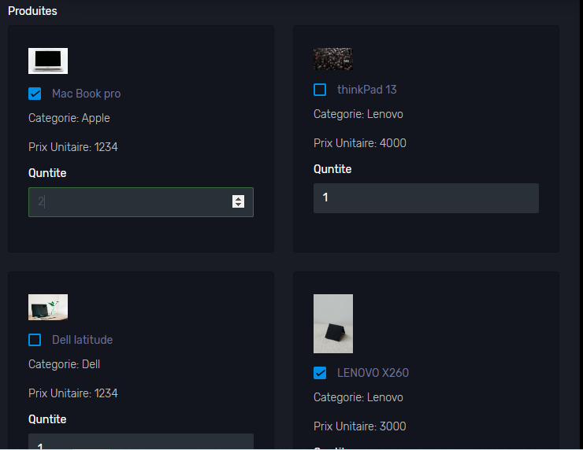
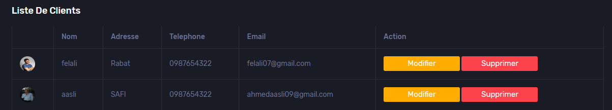
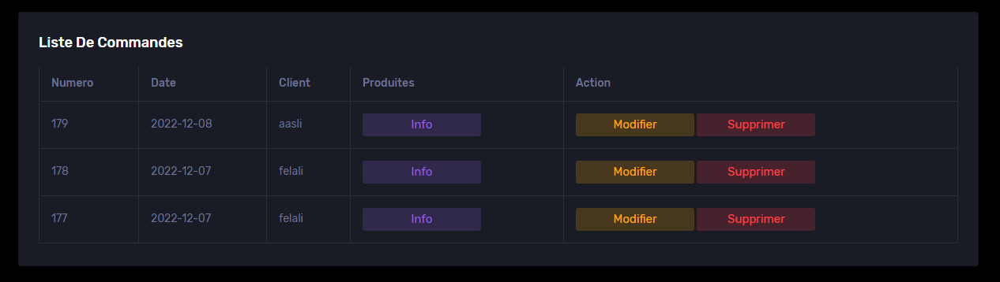
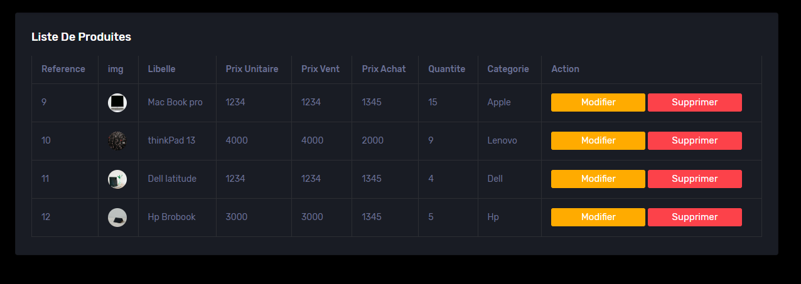
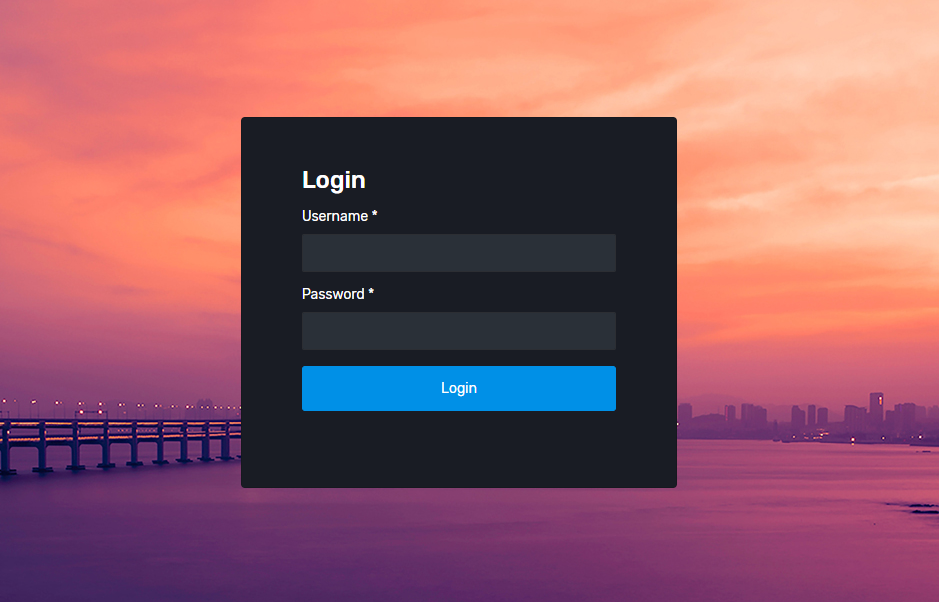

# Mstock - Projet_TechW

Gstock is a stock management system designed to streamline inventory tracking, purchasing, and sales processes. This project is built using PHP, JavaScript, and SCSS, and includes a variety of features to manage products, clients, suppliers, and more.

## Features

- **Dashboard**: Overview of key metrics and activities.
- **Product Management**: Add, modify, and manage products.
- **Client Management**: Handle client information and orders.
- **Supplier Management**: Manage supplier details and purchase orders.
- **Category Management**: Organize products into categories.
- **Order Management**: Create and track orders.
- **PDF Generation**: Generate invoices and reports in PDF format.
- **Authentication**: Secure login and session management.
- **Tools with Icons**: Access tools styled with intuitive icons for better usability.

## Project Structure

The project is organized as follows:

- **assets/**: Contains CSS, fonts, images, JavaScript, and SCSS files.
- **Class/**: PHP classes for handling business logic (e.g., `Class_Produit.php`, `Class_Client.php`).
- **Controles/**: Controllers for managing user interactions (e.g., `login.php`, `logout.php`).
- **gulp-tasks/**: Gulp tasks for automating development workflows.
- **imgs/**: Sample images used in the application.
- **pages/**: PHP pages for various functionalities (e.g., `Ajouter_Pro.php`, `Dasbord.php`).
- **pdf/**: Files for PDF generation using FPDF library.

## Technologies Used

The application is built using the following technologies:

-  **PHP**: For server-side scripting and backend logic.
-  **MySQL**: For database management and data storage.
-  **XAMPP**: For local server setup and testing.

-  **Visual Studio Code**: For efficient code editing and debugging.
-  **Bootstrap**: For responsive and modern UI design.
-  **Gulp**: For automating development workflows.
-  **FPDF**: For generating PDF reports and invoices.
-  **Chart.js**: For creating interactive and visually appealing charts.

## Screens

The application includes the following screens:

- **Product Selection for Order**: 
- **Client List**: 
- **Order List**: 
- **Product List**: 
- **Login**: 

